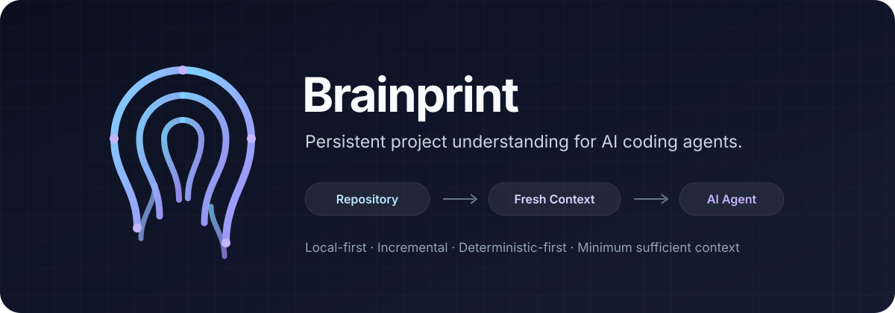

<p align="center">
  
</p>

<p align="center">
  <strong>A local-first context runtime that keeps current, structured project truth for AI coding agents.</strong>
</p>

<p align="center">
  English · <a href="./docs/README.ko.md">한국어</a> · <a href="./docs/README.ja.md">日本語</a>
</p>

# Brainprint

AI coding agents spend many tool calls and much context rediscovering things ordinary software can prepare: repository structure, unchanged source, callers and imports, project rules, and where the previous session left off.

Brainprint is a **local daemon** (`brainprintd`) that indexes a Workspace, keeps that index current while files change, and serves deterministic answers (resources, symbols, relations, impact, rules, decisions, Working State) to agents over MCP and to people over a CLI, a TUI, and a local Web UI.

> If Brainprint can know, derive, sort, deduplicate, prepare, or verify something deterministically, the agent should not have to spend reasoning on it again.

The project stays the source of truth. Brainprint is not a source backup, a Git replacement, an autonomous project manager, or a conversation archive. It prepares facts; the agent still decides, edits, and verifies.

Principles the implementation follows:

- **Correctness before savings.** `NOT_CURRENT`, `PARTIAL`, unresolved, unsupported and truncated results stay explicit. Hiding uncertainty to save tokens counts as failure.
- **Shared truth, not shared giant context.** Several agents on one Workspace share one daemon and one index instead of each re-exploring.
- **Deterministic work belongs in software.** Sorting, deduplication, bounding, pagination and continuation happen in Brainprint, not in the model.

## Status

**Pre-release, source only.** The source version is **0.1.1** (tag `v0.1.1`): the 0.1.1 efficiency and stabilization pass ([#79](https://github.com/nyangko/Brainprint/issues/79)) was accepted in [#86](https://github.com/nyangko/Brainprint/issues/86), on top of 0.1.0 accepted in [#77](https://github.com/nyangko/Brainprint/issues/77). Build it from source (below); no prebuilt binaries or packages are published. Interfaces, storage and protocol (on `master`: protocol 15, MCP envelope schema 2; `v0.1.1` speaks protocol 14) may still change.

0.1.1, measured against 0.1.0 under the same conditions ([#86](https://github.com/nyangko/Brainprint/issues/86)): `.brainprint/` 59.8 → 34.1 MiB (WAL 29.7 → 4.0 MiB); for the measured Claude Code workloads, whole-Workspace text-search and default file-listing results now arrive inline instead of being replaced by a saved-to-file notice; correctness and coverage semantics unchanged. Token/USD savings are **not proven** — native-only exploration stayed cheaper in [#32](https://github.com/nyangko/Brainprint/issues/32), [#35](https://github.com/nyangko/Brainprint/issues/35), [#74](https://github.com/nyangko/Brainprint/issues/74) and [#75](https://github.com/nyangko/Brainprint/issues/75).

| Workstream ([#12](https://github.com/nyangko/Brainprint/issues/12)) | Status |
| --- | --- |
| I0 — Benchmark Harness / Skeleton | Complete |
| I1 — Core Runtime Foundation | Complete |
| I2 — Structural Intelligence | Complete |
| I3 — Relation Graph | Complete |
| I4 — Semantic Backends | Complete |
| I5 — Project Intelligence + Projection + MCP/Skill | Complete |
| I6 — Command Intelligence | Complete |
| I7 — UX / Recovery / Acceptance | Complete — 0.1.0 accepted in [#77](https://github.com/nyangko/Brainprint/issues/77) |

## What 0.1.0 guarantees — and what it does not

**0.1.0 aims to guarantee:**

- local-first, shared current truth about a Workspace, held by one daemon per user;
- Project / Workspace / Working State continuity across sessions and agents;
- deterministic preparation of Resources, Symbols, Relations, Policies, Decisions and Working State;
- explicit freshness / currentness / coverage / partial / unsupported semantics on every answer;
- minimum-sufficient, bounded and resumable (continuation) delivery;
- fact-based measurement of its own cost (see [Benchmarks](#benchmark-and-economy-results)).

**0.1.0 does not guarantee:**

- lower model/provider cost (USD) than native-only exploration on every workload — the measurements so far show the opposite (see below);
- fewer native tool calls on every client;
- that MCP / hook / tool-schema overhead is always amortized;
- that a reduction in bytes delivered turns into a token or USD saving.

## Install and build from source

There are no prebuilt binaries or packages yet. Build from source:

```sh
git clone https://github.com/nyangko/Brainprint.git
cd Brainprint
cargo build --release
```

- Toolchain: `rust-toolchain.toml` pins the `stable` channel (with `clippy`, `rustfmt`); the minimum supported Rust is **1.89** (`rust-version` in `Cargo.toml`).
- The Web UI page is committed prebuilt (`web/build/index.html`) and embedded into the `brainprint` binary, so Node is **not** needed to build. Only rebuild it (`cd web && npm ci && npm run build`) if you change `web/src`.
- CI (`.github/workflows/acceptance.yml`) runs fmt, clippy, build and the full test suite on Linux, macOS and Windows.

The build produces four binaries in `target/release/`; put them on your `PATH`:

| Binary | Role |
| --- | --- |
| `brainprintd` | The global daemon, one per user. Started in the background on demand (see below); `brainprintd` alone runs it in the foreground until Ctrl+C. |
| `brainprint` | The CLI (also hosts the TUI and the Web UI). |
| `brainprint-mcp` | MCP server over stdio; a thin adapter to the daemon exposing four tools. |
| `brainprint-agent` | Optional client hook bridge for Claude Code, Codex CLI and Gemini CLI. |

## Updating

```sh
brainprint update --check          # installed vs. latest release; changes nothing
brainprint update                  # build the latest release from source and install it
brainprint update --version 0.1.3  # that exact release instead (never an older one)
```

**Bootstrap: `brainprint update` first ships in 0.1.2.** A 0.1.1 installation has no `update` command, so 0.1.2 is installed once the manual way above (build the `v0.1.2` tag, copy the four binaries; the 0.1.1 daemon predates `daemon stop`, so end it with Ctrl+C where it runs or end its `brainprintd` process). Releases after 0.1.2 are installed with `brainprint update`.

- **What it does.** Lists the release tags (`vMAJOR.MINOR.PATCH`) of `github.com/nyangko/Brainprint` with `git ls-remote`, fetches exactly the target tag into a temporary directory and checks that the checkout is the commit the tag names, checks it is a complete Brainprint tree of that version, runs `cargo build --release --locked` with the release's own toolchain file, and checks that all four built binaries report the target version. Until then the installation is untouched. It needs `git` and a Rust toolchain on `PATH`, and it is the only command that uses the network — nothing checks for updates on its own.
- **Which installation.** The directory of the running `brainprint` (a symlink to it resolved) — never another one on `PATH`. All four binaries must be there as regular files and the directory writable; it refuses to run from a cargo `target/` directory.
- **Activation.** The running daemon is stopped (`daemon stop`), then the four binaries are replaced together: each installed one renamed aside, the new one renamed into place — renames work on a running binary on Windows too. Any failure puts the previous four back. A daemon that was running is restarted by the *new* `brainprint` and must report the target version, or the previous set goes back and its daemon is started again; a daemon that was not running is left stopped. A daemon of another protocol (such as 0.1.1's) is reported and the update refuses before changing anything.
- **Data.** Config, `global.db`, Workspaces (ProjectID, WorkspaceID, config), durable knowledge and Working State are not touched, and nothing is rebuilt; the new daemon applies its own schema migrations when it opens them. A rollback restores binaries only: a migration the new daemon already committed is not reverted, and the older binary then refuses that database with a typed "schema newer" error instead of using it.
- **Clients.** A `brainprint-mcp` that is already running (Claude Code, Codex, Gemini) keeps the old version until its client restarts it — restart them after an update.

## Quick start

```sh
brainprint install            # 1. create ~/.brainprint/config.toml and ~/.brainprint/data/global.db
brainprint init ~/src/myrepo  # 2. attach a Workspace: creates <repo>/.brainprint/ and runs the initial index
brainprint status ~/src/myrepo
```

**The daemon starts itself.** Any command that needs `brainprintd` (and `brainprint-mcp`, the TUI and the Web UI) starts it in the background when it is not running: the `brainprintd` installed next to the running binary — never one found elsewhere on `PATH` — detached from the terminal, so closing the terminal or the MCP client leaves it running. Its output goes to `~/.brainprint/logs/brainprintd.log`. Explicit control:

```sh
brainprint daemon start     # start in the background; nothing to do if it already runs
brainprint daemon status    # running or not, version, protocol, pid -- never starts it
brainprint daemon restart   # stop, then start; Workspaces, config and knowledge are kept
brainprint daemon stop      # clean shutdown, asked over the daemon's own endpoint (no PID signals)
```

Set `BRAINPRINT_NO_AUTOSTART=1` (CI, benchmarks, development) to turn the implicit start off; commands then fail with `brainprintd is not running and auto-start is off`, and `brainprint daemon start` still works. There is no login/OS service registration: after a reboot the first command starts the daemon again.

The CLI and daemon must speak the same protocol version (use binaries from the same build). A running daemon of another protocol is reported, never replaced or downgraded: stop it (`brainprint daemon stop`; a 0.1.1 daemon predates that request, so Ctrl+C or end it where it runs) and retry.

After `init`, the daemon watches the Workspace and keeps the index current; ordinary edits need no further command. `status <path>` shows identity, revision/generation, `index: current`, `runtime: active`, `watcher: attached`, and each semantic backend's availability.

A first query (most query commands take a target selector, a `--budget` and a `--retention`):

```sh
cd ~/src/myrepo
brainprint inspect --symbol-name build_profile --budget compact --retention fresh
brainprint impact  --symbol-name build_profile --change public-signature --budget compact --retention fresh
brainprint find text --literal build_profile --search-budget compact
```

## CLI reference

Every command has `--help`. Workspace-scoped commands default to the current directory (`[PATH]` or `--workspace`, canonicalized to an absolute path). `--json` prints the machine-readable response.

**Lifecycle and recovery**

| Command | What it does |
| --- | --- |
| `install` | Create the global config and `global.db`. |
| `update [--check] [--version X.Y.Z]` | Build a Brainprint release from its exact source tag and replace all four binaries, restarting a running daemon (see [Updating](#updating)). `--check` only reports. |
| `status [PATH] [--json]` | Daemon status; with a path, the Workspace's compact status. Read-only. |
| `init [PATH]` | Create `.brainprint/` and attach the Workspace (initial index + watcher). On a detached Workspace it re-attaches. |
| `doctor [PATH] [--json]` | Read-only diagnosis: databases and schemas, identity binding, index currentness, runtime/watcher, semantic backends. Never repairs. |
| `sync [PATH] [--json]` | Reconcile the index with the filesystem now (after a checkout/rebase or while the daemon was stopped). Never modifies source. |
| `rebuild [PATH] [--json]` | Rebuild the rebuildable index (Resources, Symbols, Relations, semantic publications) from current source. Identity, config, durable knowledge, Working State and source are kept. |
| `uninit [PATH] [--json]` | Detach: stop the watcher and runtime. Source, `.brainprint/`, durable knowledge and index are kept; `init` attaches again. |
| `tui [--workspace] [--locale]` | Keyboard-first terminal view. |
| `web [--workspace] [--port 7470] [--locale]` | Local read-only Web UI on `127.0.0.1`. |

**Queries** (all accept `--workspace`, `--json`, `--client-id`, `--session-id`)

| Command | What it answers |
| --- | --- |
| `find target <selector>` | Candidates for a selector. Reads no source. |
| `find files [--directory --recursive --path-prefix --role --language --kind --limit]` | Resource inventory from the index (default limit 200). Reads no source. |
| `find text --literal\|--regex … --search-budget compact\|standard\|wide` | Explicit source-text search, bounded by results/files/bytes/deadline. Never an automatic fallback. |
| `inspect <selector>` | Exact current declaration source plus direct relations in both directions. |
| `relations <selector> --direction outgoing\|incoming\|both [--kind …]` | Direct confirmed relations, one hop, unpaged. |
| `impact <selector> --change <kind>` | What a declared change would affect (`public-signature`, `rename`, `module-move`, `base-interface`, `delete`, `domain-contract`), including related tests. |
| `context change <selector>` | Context for an edit at a target. |
| `context resume --work-item <id>` | Context to resume a WorkItem's handoff. |
| `knowledge rules \| work-items --status … \| lineage \| handoffs --work-item …` | Applicable rules; WorkItems by status; one-hop Policy/Decision lineage; handoff history. |
| `structure --group-…` | Structural summary grouped by exactly one dimension: `--group-path LABEL=PREFIX` (repeatable), `--group-directory --root R --depth N`, `--group-resource-role`, `--group-resource-language`, `--group-resource-kind`. |

Target selectors: `--resource-id`, `--resource-path`, `--resource-basename`, `--resource-prefix`, `--symbol-id`, `--qualified`, `--symbol-name`, `--partial-symbol`, or `--target-json`; narrowed with `--in-resource`, `--symbol-kind`, `--language`.

Delivery options on `find target`, `inspect`, `impact`, `context change|resume`:

- `--budget compact|standard|wide` (required), optionally `--budget-items N` / `--budget-bytes N`;
- `--retention retained|fresh|disabled` (required): `retained` = earlier acknowledged payloads are still in the caller's context, `fresh` = new/compacted context, send everything in full, `disabled` = no reuse ledger;
- `--continuation <token>` to fetch the next page after `MORE_AVAILABLE`.

**Working State and verification** (JSON input on stdin or `--input FILE`)

| Command | What it does |
| --- | --- |
| `work start` / `work result` | Record caller-observed Git state for a WorkItem (OPEN → ACTIVE, then partial/complete/abandon). Runs no Git. |
| `verification start --idempotency-key K` | Start a daemon-managed verification Job (`{"commands":[{"label","argv","cwd","env","timeout_secs","capture"}]}`; argv is executed without a shell) and return at once. |
| `verification poll <JOB_ID> [--after N --limit N]` / `verification cancel <JOB_ID>` | Read a Job's events / cancel it. |
| `artifact read <HANDLE> --stream stdout\|stderr --part head\|tail` | Read a retained head/tail chunk of captured command output (ephemeral). |

## MCP and thin Skill integration

`brainprint-mcp` speaks MCP over stdio and exposes four tools:

| Tool | Use |
| --- | --- |
| `brainprint.find` | Location: exact/search target, file listing, or explicit text search (`mode`: target, files, text). |
| `brainprint.inspect` | Exact current source and direct relations of one resolved target. |
| `brainprint.relations` | Direct relations of one anchor, or the impact of a declared change. |
| `brainprint.context` | Edit context, WorkItem resume, applicable rules, WorkItem/Decision/Policy history, structure. |

It never ranks, resolves ambiguity or picks a Working State on its own; typed outcomes such as `NOT_INITIALIZED` or partial coverage are returned as-is. Each call may pass `workspace_path` or `workspace_id`; without either, the server's startup working directory is used. The daemon must already be running.

Each result is one JSON envelope `{tool, mode, protocol_version, schema_version, outcome, payload}` (envelope `schema_version` 2), with `payload` the daemon's answer. One declared exception: a `find` `mode: text` result that skipped more than 10 binary files lists only the first 10 in `scope.binary_skipped`, and a `bounded_lists` entry gives the field and its true `total` ([#84](https://github.com/nyangko/Brainprint/issues/84)). Status, matches and the other scope lists are never shortened; `brainprint find text --json` returns the full list.

Two budgets: `budget_profile` / `max_items` / `max_bytes` size the **response** (delivery paging); `search_budget_profile` (compact 64 MiB / standard 64 MiB / wide 256 MiB) is how much source `mode: text` **scans**. `max_bytes` never widens a text scan; narrow it with `path_prefix` or pick a larger `search_budget_profile`.

Register it with any MCP client as a stdio server, for example a project `.mcp.json`:

```json
{
  "mcpServers": {
    "brainprint": { "type": "stdio", "command": "/absolute/path/to/brainprint-mcp", "args": [] }
  }
}
```

The thin Skill is [`integrations/brainprint/SKILL.md`](./integrations/brainprint/SKILL.md): prefer Brainprint for project facts when it answers current and complete; fall back to native tools when it reports partial, stale, unsupported or ambiguous. Install it the way your client loads skills/instructions (for example copy it into the client's skills directory). There is no `brainprint.run` tool.

### Client hook bridge (optional)

`brainprint-agent` translates client hook payloads into a common event and can steer the agent toward Brainprint for supported exploration:

```sh
brainprint-agent config --client claude-code --mode prefer   # prints a hook config fragment; never edits config
brainprint-agent probe  --client claude-code                 # reports the installed client and the capability matrix
```

- Clients: `claude-code`, `codex-cli`, `gemini-cli`. Ready-made fragments live in `integrations/brainprint/clients/`.
- Modes: `observe`, `prefer` (the dogfood default), `guard` (opt-in; can block a native exploration; `bypass-once --session S` allows exactly one).
- Merge the fragment into the client's hook settings yourself.
- Optional local adoption telemetry: set `BRAINPRINT_ADOPTION_TELEMETRY_PATH` to a file to append one JSONL line per event (labels, counts, digests; no prompt, source or tool-result body). Unset = disabled (default).

## TUI and Web UI

- `brainprint tui` — keyboard-first terminal view: status, inspect, relations, impact, Working State, and doctor/sync/rebuild/uninit, over the same daemon queries as the CLI. Quitting never stops the daemon.
- `brainprint web` — local Web UI (Overview; Explorer: inspect / relations / impact; Context: Working State, rules, decisions). Binds **127.0.0.1 only**, default port **7470** (`--port 0` picks a free port), read-only; stopping it never stops the daemon.
- Both show answer bodies with the CLI's compact renderer, so status and coverage read the same everywhere. Explicit text search is a CLI (`find text`) and MCP (`mode: text`) feature; the TUI and Web UI do not issue it.
- Locale: `--locale en|ko`; an unsupported tag falls back to English. Default comes from the global config:

```toml
# ~/.brainprint/config.toml
format_version = 1
[ui]
locale = "ko"
```

## Supported languages and capability boundary

Baseline: **Python, TypeScript/JavaScript, React (TSX/JSX), Svelte, C#, Rust.** Other files are indexed as resources (path, role, kind) without symbols.

Two layers:

1. **Structural (always on, built in):** tree-sitter extraction of symbols, occurrences, imports and structural relations, with explicit unresolved/candidate evidence where a name cannot be bound structurally.
2. **Semantic (optional, external):** language-server backends you install yourself. Brainprint never downloads or searches for them. With no locator configured, `status`/`doctor` show each backend as `unavailable: no backend locator in the Workspace or global config`, and answers use structural results with explicit coverage limits and gaps.

Backend locators go in `~/.brainprint/config.toml` or, per Workspace (overriding the global entry), in `<workspace>/.brainprint/config.toml`:

```toml
[semantic_backends.python]      # install_root contains node_modules/pyright-typeserver
install_root = "/opt/bp/pyright"
node = "/usr/local/bin/node"    # optional, default "node"

[semantic_backends.typescript]  # install_root contains node_modules/typescript
install_root = "/opt/bp/typescript"

[semantic_backends.svelte]      # install_root contains node_modules/svelte-language-server
install_root = "/opt/bp/svelte"

[semantic_backends.csharp]      # install_root contains packages/microsoft.codeanalysis.languageserver.<rid>/<version>
install_root = "/opt/bp/roslyn"

[semantic_backends.rust]        # path to a rust-analyzer executable
executable = "/opt/bp/rust-analyzer"
```

**C# and Rust load the project** (MSBuild evaluation; Cargo build scripts and proc macros), so they run only after an explicit per-Workspace trust decision in `<workspace>/.brainprint/config.toml`:

```toml
project_execution_trust = "Trusted"
```

Absent means Untrusted; there is deliberately no global equivalent. An untrusted C#/Rust backend is reported unavailable, never started. Backends run as separate child processes; that is crash isolation, not a security boundary.

## Freshness, coverage and continuation

Every answer states how far it can be trusted:

- **Currentness** — `Current` when the index matches the Workspace revision the runtime holds; `NOT_CURRENT` otherwise. Brainprint fails closed rather than presenting stale facts as current.
- **Coverage** — complete / partial / unsupported, with the limits that caused it (for example unresolved evidence, unattributed gaps, a reverse scope that cannot be enumerated). "No result under complete coverage" and "no result with incomplete coverage" are different answers.
- **Bounding** — `PARTIAL`, `TRUNCATED`, `MORE_AVAILABLE` plus a `CONTINUATION` token. Pass the token back with `--continuation` (CLI) or the continuation parameter (MCP) for the next page.
- **Locations** — internal spans are 0-based; JSON evidence sites carry `line_1based`, and human source headers such as `[4:1-5:50]` are 1-based `line:column`. The human column is **byte offset + 1**, not an editor's visual column on non-ASCII lines.

## Recovery

| Situation | Command |
| --- | --- |
| Something looks wrong | `brainprint doctor [PATH]` (read-only) |
| Branch switch / rebase / edits while the daemon was down | `brainprint sync [PATH]` |
| Index suspected corrupt or inconsistent | `brainprint rebuild [PATH]` |
| Stop managing a Workspace for now | `brainprint uninit [PATH]`, later `brainprint init [PATH]` |
| Daemon not running | any command starts it; or `brainprint daemon start` |

None of these modify source files. There is no `uninstall` command; to remove Brainprint completely, stop the daemon and delete `~/.brainprint/` and each Workspace's `.brainprint/`.

## Storage and data locations

| Location | Contents |
| --- | --- |
| `~/.brainprint/config.toml` | Global config (`format_version`, `[semantic_backends.*]`, `[ui]`). |
| `~/.brainprint/data/global.db` | Project/Workspace registry, user policies and preferences, blueprints. |
| `~/.brainprint/logs/`, `~/.brainprint/cache/` | Logs (e.g. backend logs) and cache. |
| `$XDG_RUNTIME_DIR/brainprint/` or `~/.brainprint/runtime/` | Daemon lock, IPC socket (`brainprintd.sock`; a short path under the OS temp dir if the full path is too long for a Unix socket), ephemeral verification artifacts. |
| `<workspace>/.brainprint/workspace.toml` | Workspace identity. |
| `<workspace>/.brainprint/config.toml` | Workspace config: `extra_excluded_directory_names`, `[semantic_backends.*]` overrides, `project_execution_trust`. |
| `<workspace>/.brainprint/data/project.db` | Durable project knowledge (policies, decisions, project state). |
| `<workspace>/.brainprint/data/workspace.db` | Working State, WorkItems, verification jobs. |
| `<workspace>/.brainprint/data/index.db` | The rebuildable index (resources, symbols, occurrences, relations, semantic publications). |

On Windows the IPC endpoint is a named pipe and home is `%USERPROFILE%`.

**Source ownership.** The source tree remains the source of truth. `.brainprint/` stores structured understanding (identities, symbols with signatures and spans, relations, fingerprints, knowledge, state), not a copy of file bodies — a schema test (`no_schema_stores_raw_source_body`) enforces this. Source text shown in answers is read from the current file at query time. Add `.brainprint/` to your `.gitignore`.

Discovery always skips `.git`, `.brainprint`, `node_modules`, `venv`, `.venv`, `virtualenv`, and skips `target`, `bin`, `obj`, `build`, `dist` when project markers show they are build output. By design, `.gitignore` (and `.git/info/exclude`, global excludes, `.brainprintignore`) does **not** decide which files Brainprint indexes ([#82](https://github.com/nyangko/Brainprint/issues/82)): Git-ignored files are often generated source, local config or test fixtures that the code really uses, and dropping them would turn real symbols and imports into false "not found" or external answers. The index, the watcher and text search all use this one rule set, with or without Git. To exclude a large vendor/cache tree, add its directory name (names, not globs):

```toml
# <workspace>/.brainprint/config.toml
extra_excluded_directory_names = ["vendor", "third_party"]
```

The list is read when the Workspace is attached: after changing it, run `brainprint uninit` then `brainprint init` (or `brainprint daemon restart`); `sync` alone does not reload it. The matching Resources are then removed (as deleted); taking a name back out re-adds them with new Resource ids. Excluding a directory by name is also how to stop an unreadable directory (for example a container-owned data directory) from keeping the index `NOT_CURRENT` — see [Known limitations](#known-limitations).

### Measured footprint (one example, not a guarantee)

On this repository (579 files, macOS, release build, no semantic backend configured): daemon idle RSS ~6–8 MiB; ~16–20 MiB steady with one Workspace after the initial index, ~21 MiB peak with 5 concurrent clients; `init` + initial index ~4–5 s; `.brainprint/` ~34 MiB (`index.db` ~30 MiB + WAL capped at 4 MiB, [#80](https://github.com/nyangko/Brainprint/issues/80)). Your numbers will differ with repository size and configured backends.

## Local-first and privacy

- Daemon IPC is a local Unix socket (Windows: named pipe). The only TCP listener is the optional Web UI, bound to `127.0.0.1`.
- Brainprint contains no HTTP client and sends no telemetry anywhere. The only optional telemetry is the `brainprint-agent` JSONL file you enable with `BRAINPRINT_ADOPTION_TELEMETRY_PATH`, written locally.
- External processes are only the semantic backends you configure, the verification commands you explicitly submit, and the `git`/`cargo` that `brainprint update` runs when you run it (it reads the public repository; nothing is sent); what those programs do is up to them.
- Nothing is uploaded; there is no account or cloud component.

## Benchmark and economy results

Brainprint measures itself against native-only exploration (the same agent with Read/Grep/Glob/shell and no Brainprint). Results so far with Claude Code on this repository:

| Benchmark | Result |
| --- | --- |
| [#32](https://github.com/nyangko/Brainprint/issues/32) I5 economy (`benchmarks/i5-task14/`) | Brainprint integration path cost **more**: native $0.579/session vs Brainprint $0.974/session (+68%), although native exploration calls fell 41% and native result bytes fell 44%. |
| [#35](https://github.com/nyangko/Brainprint/issues/35) MCP contract alternatives A–E (`benchmarks/issue-35-contracts/`) | Every tested contract cost more than native (+$0.30 to +$0.49 per session). |
| [#74](https://github.com/nyangko/Brainprint/issues/74) first-route exact substitution (`benchmarks/issue-74-first-route/`) | The substitution candidate cost more than native ($0.538 vs $0.500 per session). |
| [#75](https://github.com/nyangko/Brainprint/issues/75) adaptive routing on a real project (`benchmarks/issue-75-adaptive-routing/`) | In every measured class and condition: native < adaptive routing < forced Brainprint. No production router ships. |

So **Brainprint 0.1.0 does not deliver lower provider cost than native-only exploration** in these measurements. What it offers today is the shared, current, explicitly-qualified project truth and continuity listed under [guarantees](#what-010-guarantees--and-what-it-does-not). Raw data, harnesses and per-task tables are in `benchmarks/`.

## Known limitations

1. **Compact rows are terse, not prose.** Relation rows name endpoints by id, a relation gap is located as `<resource id>:<line>`, and evidence without a source span (target selection, coverage reports) prints in Rust `Debug` form. Coverage is always stated (`Incoming: 4 confirmed, coverage Partial (…)`, `boundary edges: None found -- coverage incomplete`), and every line number shown is the 1-based editor line ([#78](https://github.com/nyangko/Brainprint/issues/78)).
2. **Columns are bytes.** The human column is byte offset + 1, not a visual column on non-ASCII lines.
3. **`standard`/`wide` can be too large for some MCP clients.** A result can exceed the client's tool-output limit (Claude Code 2.1.292 replaced results above roughly 46–51 K characters with a saved-to-file notice). For delivery-paged answers use `compact` and continuation. Text search has no continuation: at `compact` (the MCP default, at most 50 matches) results stay inline; for more matches narrow `path_prefix` (roughly 130 matches fit) rather than raising `search_budget_profile`.
4. **Whole-Workspace text search can truncate.** A broad `find text` stops at its search budget (64 MiB at `compact`) and returns `TRUNCATED` when a rare or absent pattern needs more bytes than that — on this repository even with only tracked files (10.7 MB). Large untracked vendor/cache trees make it more frequent ([#82](https://github.com/nyangko/Brainprint/issues/82)). Use `--path-prefix`, a larger `--search-budget`, or `extra_excluded_directory_names`.
5. **One unreadable file or directory keeps the index `NOT_CURRENT`.** Every answer is still returned, labelled `NOT_CURRENT`, and every current-dependent query re-runs a reconcile that fails on that path (on this repository about +50 ms per query; more on larger trees). Other Workspaces are unaffected, and restoring read permission recovers automatically on the next query. To leave such a directory out, exclude its name (see [Storage](#storage-and-data-locations)).
6. **Semantic backends are separate installs.** Without them, results are structural with explicit gaps; C#/Rust additionally need `project_execution_trust = "Trusted"`.
7. **No cost-saving guarantee.** See [Benchmarks](#benchmark-and-economy-results).
8. **Manual setup.** No packages, no OS service or login item for the daemon (it starts on first use), no client auto-configuration; `find files` listings are capped (default 200 in the CLI, 50 over MCP).

## Roadmap

| Version | Primary axis |
| --- | --- |
| 0.1.0 | Token & Context Economy — the baseline above |
| 0.2.0 | Deterministic Work Offload |
| 0.3.0 | Rules & Project Intelligence |
| 0.4.0 | Language & Ecosystem Expansion |
| 0.5.0 | Persona & Role Awareness (presentation only, never truth) |
| 1.0.0 | Stable release after a separate hardening gate |

- [#12 — P0 implementation roadmap](https://github.com/nyangko/Brainprint/issues/12)
- [#18 — 0.1.0–0.5.0 → 1.0.0 product roadmap](https://github.com/nyangko/Brainprint/issues/18)

## Documentation

This README documents version 0.1.1 (current `master`); the GitHub Wiki is not set up. Command details: `brainprint <command> --help`. Agent instructions: `integrations/brainprint/SKILL.md`. Benchmark reports: `benchmarks/`.

## License

GPL-3.0-only. See [LICENSE](./LICENSE).
