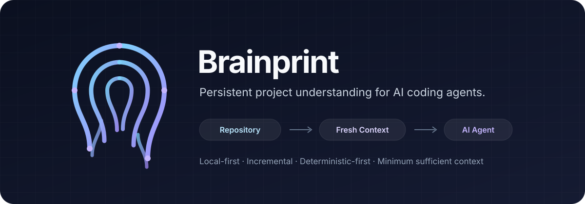

<p align="center">
  
</p>

<p align="center">
  <strong>AI コーディングエージェントが読む量と再探索を減らし、本当に判断が必要な作業へ推論を使えるようにするローカルファースト・コンテキストランタイム。</strong>
</p>

<p align="center">
  <a href="../README.md">English</a> · <a href="./README.ko.md">한국어</a> · 日本語
</p>

# Brainprint

AI コーディングエージェントは推論には強い一方で、通常のソフトウェアならはるかに安く処理できる作業にも、コンテキストとツール呼び出しを繰り返し消費します。

- リポジトリ構造を再探索する
- 変更されていないソースを読み直す
- 同じ caller / import 関係を再度追跡する
- 新しいセッションや compaction の後にプロジェクト状態を再構築する
- raw tool output を再度 sort / dedupe / group / filter する
- 一度準備しておけばよい Git / test / build の探索を繰り返す

Brainprint は、プロジェクトとエージェントの間に置かれる **永続的なローカルファースト・コンテキストランタイム**として開発されています。

Brainprint の役割はエージェントの判断を置き換えることではありません。エージェントに、現在の作業に必要な **最小限で十分・最新・構造化されたプロジェクト情報**を渡し、実装・trade-off・検証に推論を集中させることが目的です。

> **Brainprint が事実を知っている、または決定論的に計算・整列・重複除去・準備・検証できるのであれば、エージェントが推論トークンを使って同じことをやり直す必要はありません。**

## コアアイデア

従来のエージェントワークフローは、しばしば次のようになります。

```text
Agent
  → ls / find
  → rg
  → ファイル read
  → import / caller 関係を再構築
  → raw 結果を sort / dedupe / filter
  → Git 状態を確認
  → プロジェクトルールを再探索
  → ようやく実際の変更判断を開始
```

Brainprint は、この補助作業をモデルの外へ移すことを目指します。

```text
Project / Workspace
        ↓
    brainprintd
        ↓
   fresh structured truth
        ↓
  prepare / dedupe / bound
        ↓
      MCP / CLI
        ↓
      Agent
        ↓
  判断 / 編集 / 検証
```

プロジェクトそのものが Source of Truth です。Brainprint はソースのバックアップ、Git の代替、自律型プロジェクトマネージャー、汎用会話アーカイブではありません。

## 製品原則

### 1. 追加ではなく置換 — Substitution, not addition

Brainprint を呼んだ後で、エージェントが同じ目的の `ls/find/rg/read/git` をもう一度実行するのであれば意味がありません。

Brainprint は反復探索の前にツールを一つ追加するのではなく、反復探索そのものを減らす必要があります。

### 2. そのまま作業できるだけの情報を準備 — Prepare enough to work

Brainprint が exact current source range、直接 consumer、関連 test、結果の不確実性まで把握しているのに、ファイル名や行番号だけを返すのでは不十分です。

projection が小さすぎるせいでエージェントが再び read / rg をするなら失敗です。

### 3. 決定論的な作業は Brainprint が処理 — Deterministic work belongs in Brainprint

ランタイムは、次のような安価で反復可能な処理を直接行うべきです。

```text
sort
dedupe
filter
group
count
set intersection
range merge
overlap removal
stable ordering
candidate bounding
pagination
continuation
diff
known-state comparison
budget enforcement
deterministic output compaction
```

数百件の raw item をモデルに渡し、そこで並べ替えや削減をさせるのはトークン最適化ではありません。通常の計算を最も高価なレイヤーへ移しているだけです。

### 4. 巨大な共有コンテキストではなく共有された truth — Shared truth, not shared giant context

複数のエージェントは同じ Project / Workspace の最新 truth を共有できるべきですが、各 worker が巨大な parent transcript を複製して持つべきではありません。

### 5. 節約より正確性を優先 — Correctness before savings

`STALE`, `PARTIAL`, `UNRESOLVED`, `UNSUPPORTED`, truncation などの状態は明示的に維持する必要があります。

トークンを減らすために不確実性を隠すのは失敗です。

### 6. 熟練判断はエージェントに残す

Brainprint は fact、evidence、state、rule、verification target を準備します。

エージェントが担当するのは次の部分です。

- 問題の解釈
- 変更戦略の選択
- コードの作成
- trade-off の評価
- 不確実性の解釈
- 最終検証の判断

## アーキテクチャ

Brainprint は、一つの global local daemon と Workspace ごとの runtime を中心に設計します。

```text
Codex / Claude / Gemini / other agents
                │
          MCP / thin Skill
                │
                ▼
          global brainprintd
                │
        ┌───────┼────────┐
        ▼       ▼        ▼
   Workspace A  B        C
        │
        ├─ Resource / Symbol / Occurrence
        ├─ Relation / unresolved / candidates
        ├─ freshness / revision / generation
        ├─ current source preparation
        ├─ project / working state
        └─ command intelligence
```

基本モデルは次の通りです。

- **Project truth は共有します。**
- **Task context は共有しません。**
- 同じ Workspace の高コストな parsing / semantic 結果は複数の Agent で再利用します。
- WorkItem / Role / Persona metadata は後段の projection を調整できますが、source fact、Relation、freshness 自体を変更してはいけません。

## Brainprint 0.1.0 → 0.5.0 → 1.0.0

Brainprint は 5 つの pre-1.0 製品段階を経て、その後に独立した stabilization / hardening を行い、1.0.0 へ昇格します。

各バージョンは、そのリリースで **最も強く改善する価値軸**を示します。後のバージョンのテーマだからといって、実利用に必要な最低限の機能がそれ以前に存在しないという意味ではありません。

| Version | 主な目標 | 中心となる問い |
| --- | --- | --- |
| **0.1.0** | **Token & Context Economy** | 正確性を保ちながら、反復 read/search/context/support work をどれだけ減らせるか？ |
| **0.2.0** | **Deterministic Work Offload** | 通常のソフトウェアでできる計算を LLM にさせずに済むか？ |
| **0.3.0** | **Rules & Project Intelligence** | 現在の作業に必要なルール・決定・作業状態だけを正確に渡せるか？ |
| **0.4.0** | **Language & Ecosystem Expansion** | 実際の開発システムを、どこまで広く正確に理解できるか？ |
| **0.5.0** | **Persona & Role Awareness** | project truth を変えずに、作業者に合わせて projection だけを調整できるか？ |
| **1.0.0** | **Stable Release / Hardening** | Brainprint を stable と呼べるほど、正確・安定・最適化・保守・復旧・文書化されているか？ |

詳細なリリース目標は [#18 — Brainprint 0.1.0~0.5.0 → 1.0.0 製品ロードマップ](https://github.com/nyangko/Brainprint/issues/18) で管理します。

### 0.1.0 — Token & Context Economy

最初の実用リリースは単なる indexing demo ではなく、実際のプロジェクトで dogfooding できる必要があります。

0.1.0 baseline には次を含みます。

- local daemon と Workspace identity
- structural code intelligence
- Relation Graph と impact evidence
- current-source preparation
- semantic backend baseline
- project rules / decisions / Working State baseline
- request-shaped Context Projection
- Git/test/lint/typecheck/build intelligence
- high-level MCP + thin Skill
- deterministic sort/dedupe/filter/bounding baseline
- multi-Agent shared truth
- real-project benchmark と dogfooding

### 0.2.0 — Deterministic Work Offload

0.1.0 の baseline を拡張し、モデルが行う機械的作業をさらに減らします。

result shaping、反復 diagnostics の圧縮、deterministic diff/state comparison、delivery reuse、verification delta を強化し、実際の benchmark で効果が確認できた adaptive optimization のみを追加します。

### 0.3.0 — Rules & Project Intelligence

Project Policy、Decision、Blueprint、Working State lineage、precedence、conflict handling、handoff/resume、applicable-rule projection を強化します。

目標は、新しい Agent に毎回 **「このプロジェクトをどのように作業すべきか」** を再発見させないことです。

### 0.4.0 — Language & Ecosystem Expansion

0.1.0 から Python、TypeScript/JavaScript、React、Svelte、C#、Rust の実用 baseline を目標にします。

0.4.0 では additional language、framework adapter、ORM/database relation、route、event、queue、cache/config semantics、cross-project relation など、semantic depth とエコシステム理解の範囲を広げます。

### 0.5.0 — Persona & Role Awareness

Persona は意図的に最後の段階に置きます。

Role/Persona は **どの evidence を先に見せるか、どの程度の詳細で projection するか** は変えられますが、project truth 自体を変えてはいけません。

```text
Truth
  → task/context selection
  → optional Role/Persona adjustment
```

次の構造は禁止します。

```text
Persona
  → truth interpretation
```

Persona が実際に測定可能な価値をほとんど生まないのであれば、最小限の機能に留めます。

### 1.0.0 — Stable Release

1.0.0 は 0.5.0 の次に来る別の機能セットではありません。

独立した stabilization / hardening を通過した後にのみ、Brainprint を stable と呼びます。

1.0.0 へ昇格する前に、少なくとも次を検証します。

- 実プロジェクトで correctness と主要 bug が解消されていること
- core workflow の regression coverage が十分であること
- CPU/RAM/I/O/index size と長時間 background cost が許容範囲であること
- token/context/tool-call の改善が実測されていること
- multi-Agent の安定性と recovery が検証されていること
- migration/upgrade path が安全であること
- 重要モジュールのコード品質と保守性が十分であること
- CLI/MCP/public contract が stable release の水準まで整理されていること
- README/Wiki/API の実際の挙動が一致していること
- language/feature coverage と limitation を誇張していないこと

0.5.0 が完了したという理由だけで **1.0.0 をタグ付けしません。**

## 現在の実装状況

Brainprint は現在 **0.1.0 を実装中**です。

実装ロードマップは [#12 — P0 実装ロードマップ](https://github.com/nyangko/Brainprint/issues/12) で管理します。

| Workstream | 状態 |
| --- | --- |
| I0 — Benchmark Harness / Skeleton | 完了 |
| I1 — Core Runtime Foundation | 完了 |
| I2 — Structural Intelligence | 完了 |
| I3 — Relation Graph | 進行中 |
| I4 — Semantic Backends | 予定 |
| I5 — Project Intelligence + Projection + MCP/Skill | 予定 |
| I6 — Command Intelligence | 予定 |
| I7 — UX / Recovery / Acceptance | 予定 |

実装は意図的に下から積み上げます。まず信頼できる project fact と freshness を作り、その上に relation と semantic を構築し、最後に projection と Agent-facing interface を接続します。

## 0.1.0 で目指す使用感

例えば次の依頼を考えます。

```text
"このメソッドのシグネチャを変更して、影響を受ける箇所をすべて修正して。"
```

目標とする体験は次ではありません。

```text
Agent → search → read → search → import確認 → caller検索
      → test検索 → source再読 → state再構築 → 編集
```

次のような流れを目指します。

```text
Brainprint
  → current target source
  → confirmed callers / references / type consumers
  → 関連 current source ranges
  → related tests
  → applicable project rules
  → unresolved / unsupported gaps
  → current workspace state

Agent
  → 判断
  → 編集
  → 検証
```

## 成功をどう測るか

機能数は最も重要な成功指標ではありません。

Brainprint は、実際に次を減らせたかを測る必要があります。

- Agent tool calls
- 変更されていない source の反復 read
- 渡される raw source bytes
- context/token volume
- Agent 間の重複分析
- Agent が直接行う不要な sort/dedupe/filter/group/count
- 長時間作業での support-work ratio

同時に次も測定します。

- correctness と missed dependency
- false-positive Relation
- stale/partial error
- latency
- CPU/RAM/I/O
- index size

不確実性を隠すことで得た token 削減は成功とはみなしません。

## データモデルと保存方針

Brainprint はプロジェクトの二重コピーではなく、**構造化された理解**を保存します。

例えば次を保持します。

- stable Project/Workspace/Resource identity
- Symbol と Occurrence
- canonical Relation
- unresolved/candidate evidence
- fingerprint と revision state
- project decision と Working State

元の source、image、audio、video などの project asset は外部 resource のまま残し、identity/location/fingerprint で参照します。rebuildable index はいつでも再生成できるべきです。

## Agent 連携

0.1.0 で想定する連携構造は次の通りです。

```text
Agent plugin / extension
        │
   thin Skill + MCP
        │
        ▼
   brainprintd
```

Agent ごとに packaging 方法は異なっても Core は一つであるべきです。Codex、Claude、Gemini などの各 client が、同じ Workspace のために別々の project intelligence engine を立ち上げるべきではありません。

Marketplace ごとの packaging や、より豊富な one-click distribution は 0.1.0 integration contract が検証された後に発展させられます。

## ドキュメント

pre-1.0 開発中もドキュメントは継続して更新しますが、**1.0.0 昇格前には実際に acceptance された実装を基準に README/Wiki を最終監査**します。

Wiki では次を扱う予定です。

- architecture と identity model
- freshness/revision/generation
- structural/semantic intelligence
- Relation Graph
- project/Working State
- Context Projection と Task Packet
- MCP / Skill / Agent integration
- CLI
- storage/data policy
- multi-Agent concurrency
- recovery/troubleshooting
- benchmark/acceptance
- language coverage
- design decisions と known limitations
- developer/contributor guide

## 設計・実装の追跡

- [#12 — P0 実装ロードマップ](https://github.com/nyangko/Brainprint/issues/12)
- [#18 — Brainprint 0.1.0~0.5.0 → 1.0.0 製品ロードマップ](https://github.com/nyangko/Brainprint/issues/18)

設計 Issue は architecture decision の Source of Truth として維持し、実装 Issue は実際の作業を追跡します。

## 現在の成熟度

**Active pre-1.0 development. 現在の目標: 0.1.0.**

0.x 開発中は interface、storage detail、integration contract が変更される可能性があります。

計画された機能段階がすべて終わったという理由だけで 1.0.0 へ昇格しません。correctness、bug、performance、resource usage、code quality、upgrade/recovery、public contract、documentation を独立した stabilization/hardening review で検証する必要があります。
